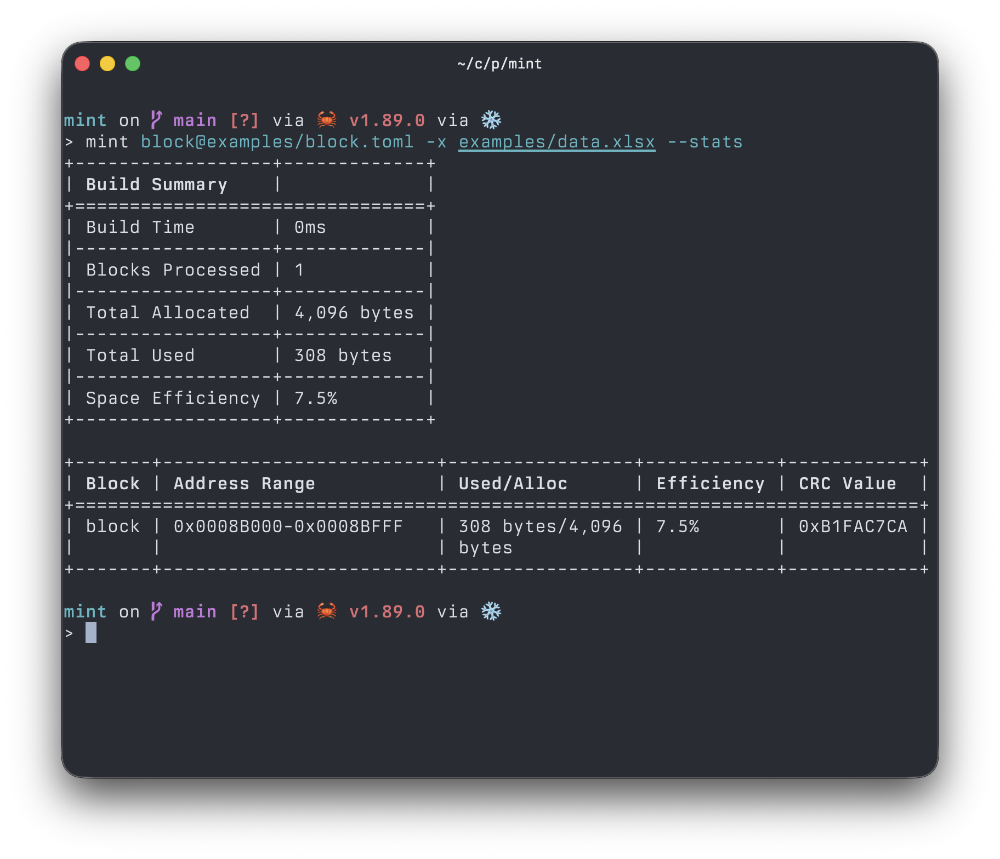

## mint

Build flash blocks from a layout file (TOML/YAML/JSON) and an Excel workbook, then emit hex files.

Install with `cargo install mint-cli`.

Run `mint --help` for all available options. Example layouts and data are in the `examples/` directory.
