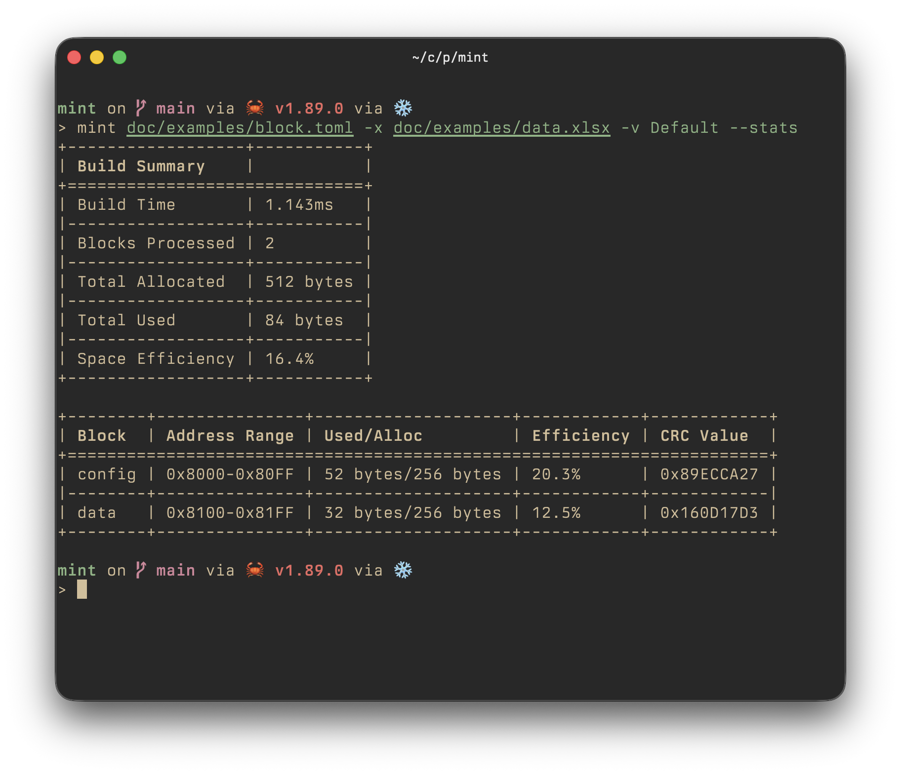

## mint

Build flash blocks from a layout file (TOML/YAML/JSON) and a data source (Excel or Postgres), then emit hex files.



Install with `cargo install mint-cli` or via nix flakes.

### Documentation

- [CLI reference](doc/cli.md)
- [Data sources](doc/sources.md) (Excel & Postgres)
- [Example layouts & data](doc/examples/)

### Quick Start

```bash
# Excel data source
mint layout.toml -x data.xlsx -v Default

# Postgres data source
mint layout.toml -p config.json -v Debug/Default

# Multiple blocks with options
mint config@layout.toml calibration@layout.toml -x data.xlsx -v Production/Default --stats
```

### Layout Example

```toml
[block.data]
device.info.version.major = { name = "FWVersionMajor", type = "u16" }
device.info.name = { name = "DeviceName", type = "u8", size = 16 }
calibration.coefficients = { name = "Coefficients1D", type = "f32", size = 8 }
calibration.matrix = { name = "CalibrationMatrix", type = "i16", size = [3, 3] }
message = { value = "Hello", type = "u8", size = 16 }
```

See [`doc/examples/block.toml`](doc/examples/block.toml) for full examples.
